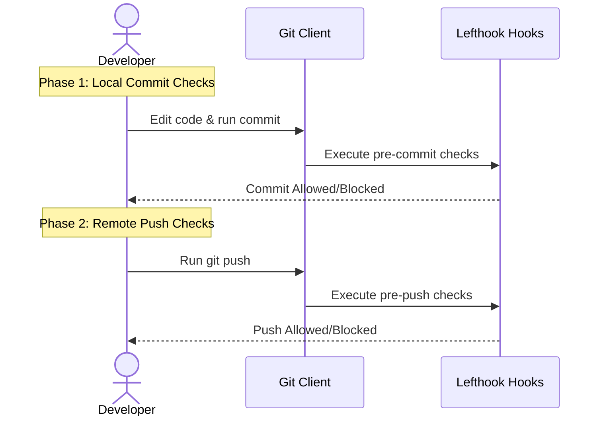
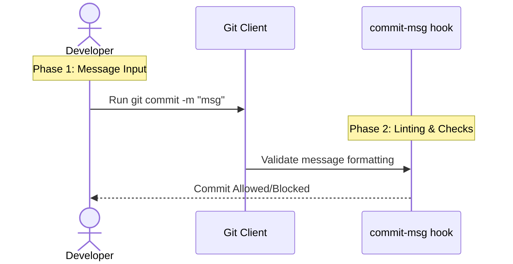
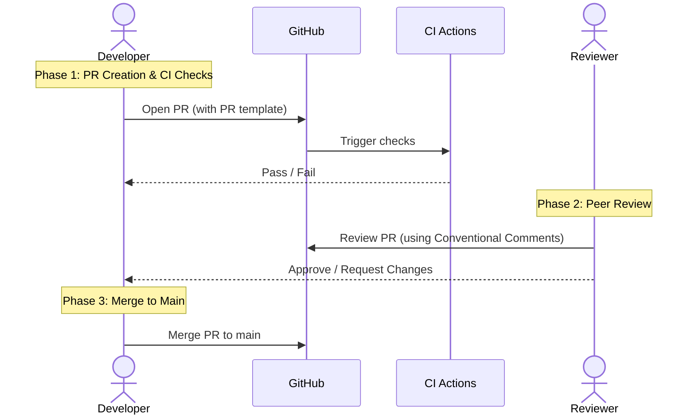
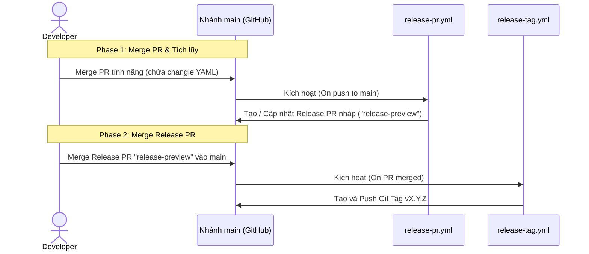
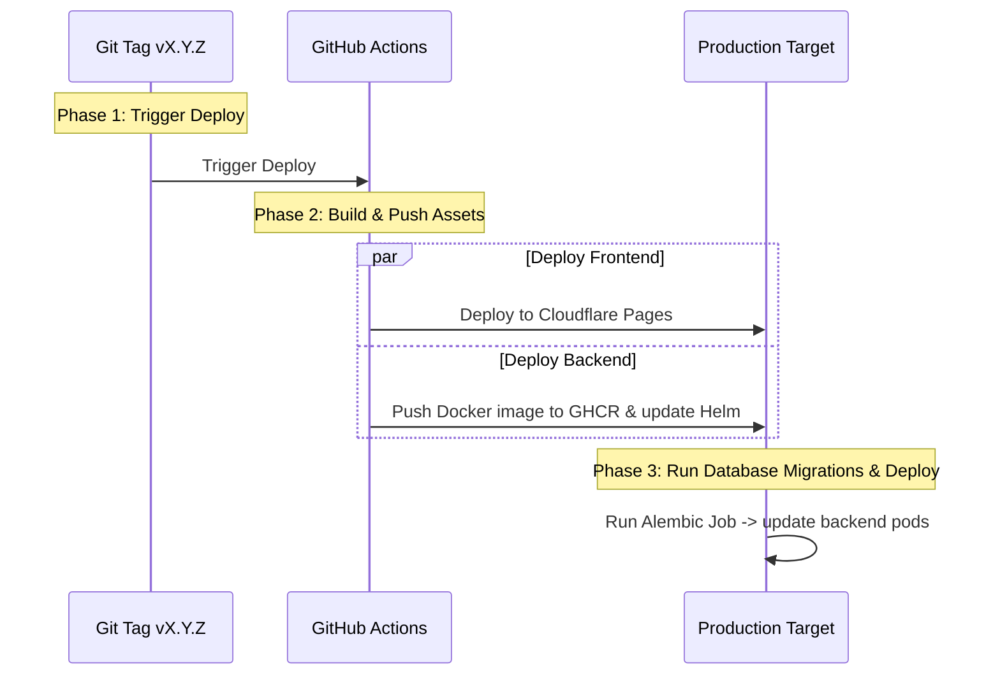

# Contributing to Uscornie

This guide outlines our contribution process chronologically, from local development to production deployment.

## Contents
1. [Development Loop (TBD)](#1-development-loop-tbd)
    * [Phase 1: Local Commit Checks](#phase-1-local-commit-checks-pre-commit)
    * [Phase 2: Remote Push Checks](#phase-2-remote-push-checks-pre-push)
2. [Commit Standards (Conventional)](#2-commit-standards-conventional)
    * [Header and Body Rules](#rules--formatting)
    * [Example Commit](#example-valid-commit)
3. [Pull Request Process](#3-pull-request-process)
    * [PR Guidelines](#pull-request-guidelines)
    * [Diagram Standards](#code-architecture--design-diagrams)
    * [Review Standards (Conventional Comments)](#code-review-standards-conventional-comments)
4. [Versioning & Release PR (Changie)](#4-versioning--release-pr-changie)
5. [Deployment & GitOps](#5-deployment--gitops)

---

## 1. Development Loop (TBD)

We practice **Trunk-Based Development (TBD)**. All developers merge changes frequently into the `main` branch. 
*   **Always pull the latest `main`** branch locally before creating any new feature or fix branch.
*   **Regularly merge `main`** into your local working branch to resolve potential integration conflicts early.




We use [Lefthook](https://github.com/evilmartians/lefthook) to run local quality validations:

### Phase 1: Local Commit Checks (`pre-commit`)
Triggers automatically on `git commit`. Blocks commit creation if checks fail.
*   `gitleaks`: Scans staged changes for accidental secrets exposure.
*   `hadolint`: Lints Dockerfiles.
*   `rumdl`: Lints Markdown files.
*   `ruff`: Lints and formats Python backend changes.
*   `biome`: Lints and formats React/TypeScript frontend changes.

### Phase 2: Remote Push Checks (`pre-push`)
Triggers automatically on `git push`. Blocks branch push to remote repository if checks fail.
*   `semgrep`: Runs static security vulnerability scanning.
*   `pytest`: Executes Python backend unit and integration tests.
*   `ty check`: Validates Python static type checking.
*   `bun run build`: Verifies the Next.js frontend builds successfully.

---

## 2. Commit Standards (Conventional)

We enforce **Conventional Commits v1.0.0** at the Git hook level using `commitlint`.



### Rules & Formatting
*   **Header Format**: `<type>(<scope>): <description>` (e.g. `feat(auth): add google login endpoint`).
*   **Header Word Limit**: Maximum of **15 words** in the header.
*   **Blank Line**: A blank line **must** separate the header from the body.
*   **Body Constraints**:
    *   A body is **ALWAYS** required (commits without a body will be rejected).
    *   The body must contain exactly **3 to 5 bullet points**.
    *   Each bullet point must start with `- `.
    *   Each bullet point must have a **maximum of 2 sentences**.
    *   Each bullet point must have a **maximum of 10 words**.

> [!NOTE]
> In the hook `run: bunx commitlint --edit {1}`, `{1}` is a Lefthook placeholder representing the absolute file path to the temporary commit message file (`.git/COMMIT_EDITMSG`) passed by Git to the `commit-msg` hook.

### Example Valid Commit:
```text
fix(auth): validate token expiration on api request

- token expiry validated per request.
- middleware checks exp payload.
- invalid tokens return 401.
```

---

## 3. Pull Request Process

All code changes must go through a Pull Request (PR) before merging to the `main` branch.



### Pull Request Guidelines
1. **Target Branch**: Target `main`.
2. **Review & Tests**: PR merge requires passing CI.
3. **Merge Method**: Always use **Squash and Merge**. This consolidates all feature commits into a single commit on `main`, keeping the trunk history clean and linear.
4. **PR Template**: Use [.github/pull_request_template.md](file:///Users/khoanguyen/work/uscornie/.github/pull_request_template.md).
   ```markdown
   ## Context
   - **Closes**: # <Issue_Number>

   ## What changed?
   - <Brief summary of changes>
   ```

> [!TIP]
> **Enforcing Squash and Merge on GitHub**: 
> Go to **Settings** > **General** > **Pull Requests**. Enable **Allow squash merging**, and disable both **Allow merge commits** and **Allow rebase merging**. This forces developers to use Squash and Merge when gộp PRs.

### Code Architecture & Design Diagrams
We highly encourage using diagrams for any architectural, structural, or logical changes. Use the following diagram standards:
*   **Sequence Diagram**: Use to describe interactions between multiple actors/systems over time.
*   **Flowchart**: Use to map out logical decision paths, branching logic, and step-by-step processes.
*   **State Diagram**: Use to model lifecycle states and transitions of resources (e.g. user invite state).
*   **ER/Class Diagram**: Use to describe database schemas or class structures.

### Code Review Standards (Conventional Comments)
Reviewers must format comments using the [Conventional Comments](https://conventionalcomments.org/) specification.

#### Format:
` <label> [decorations]: <subject> [discussion]`

*   **Labels**:
    *   `praise`: Recognize good decisions.
    *   `suggestion`: Propose alternative implementation.
    *   `issue`: Highlight bugs, security flaws, or errors.
    *   `nitpick`: Small stylistic preferences (non-blocking).
    *   `question`: Ask for clarification.
    *   `thought`: General ideas.
*   **Decorations (Optional)**: E.g., `(blocking)` or `(non-blocking)`.

#### Examples:
*   `suggestion (non-blocking): extract this logic to a reusable helper function.`
*   `issue (blocking): this endpoint lacks rate-limiting.`

---

## 4. Versioning & Release PR (Changie)

We use **Unified Versioning** (both frontend and backend share the same version tag) managed by [Changie](https://changie.dev/) and automated through a **Release Pull Request** flow.



### Workflow:
1. When developing a feature, run:
   ```bash
   changie new
   ```
2. Follow the prompt to select the affected component (`backend`, `frontend`, `infra`, `docs`) and input your description. Commit the YAML fragment file along with your code changes.
3. Once your PR is merged, the `release-pr.yml` workflow automatically batches changes and creates/updates a pending **Release Pull Request** (`release-preview` -> `main`).
4. When you want to trigger the release, simply **Merge** the Release Pull Request. The `release-tag.yml` workflow automatically creates the Git Tag (`vX.Y.Z`), which starts the deployment.

---

## 5. Deployment & GitOps

Production deployments are automated upon tag release.



### Frontend Deployment (Cloudflare Pages)
*   Frontend automatic Git builds on push to `main` are **disabled** in the Cloudflare dashboard.
*   Production deployments are handled exclusively by the GitHub Actions `release.yml` workflow using Wrangler CLI (`bunx wrangler pages deploy`) after a release tag is officially pushed.

### Backend Deployment (Kubernetes / ArgoCD)
The backend is packaged into Docker containers and deployed to Kubernetes.
*   **values.yaml Configuration**: Review parameters in [values.yaml](file:///Users/khoanguyen/work/uscornie/infra/charts/backend/values.yaml).
*   **ArgoCD Switch**: If deploying with ArgoCD, set `argoCD: true` in your values overrides. This switches the database migration hooks to use ArgoCD `PreSync` hooks instead of Helm lifecycle hooks.
*   **Database Migrations**: Alembic migrations run automatically on deployment via a Kubernetes Job wrapper. If the migration fails, deployment is aborted to prevent running mismatched database schemas.
