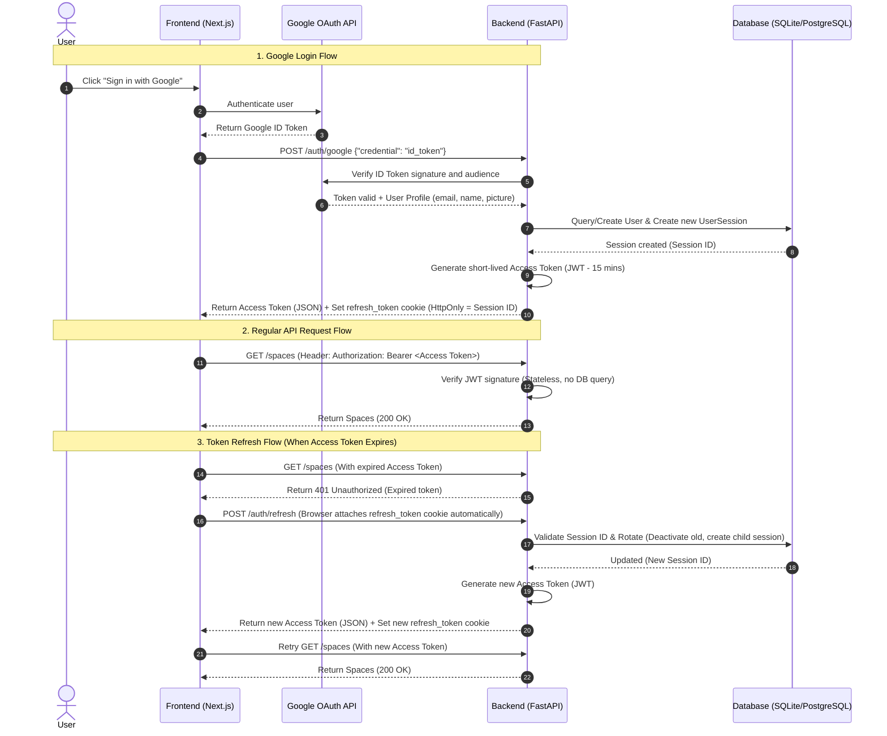
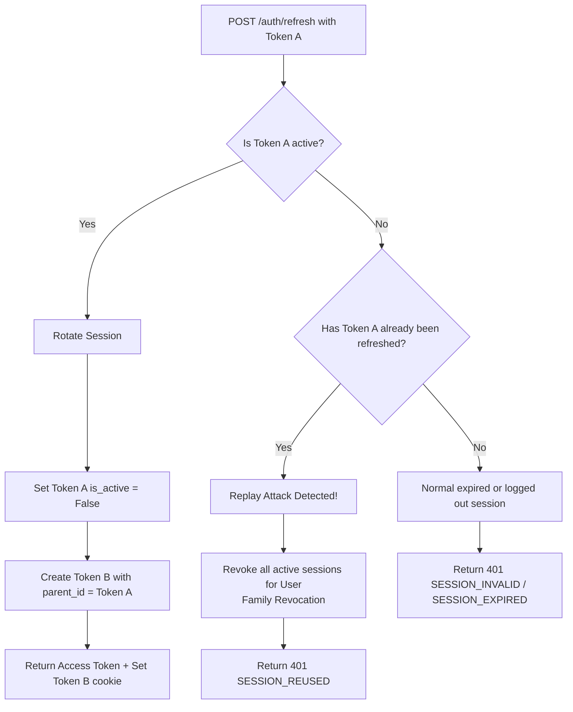
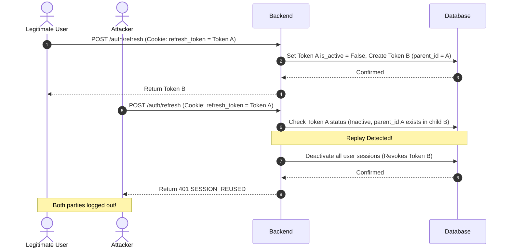
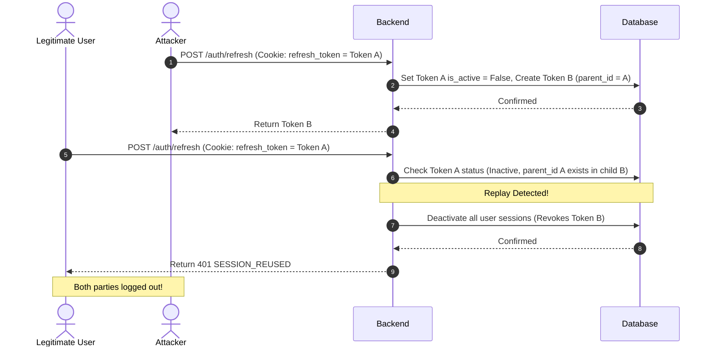

# Authentication & Authorization System

This module handles multi-session authentication, token rotation, and Role-Based Access Control (RBAC).

## 1. Authentication Flow

The backend uses a hybrid architecture combining stateless JWTs (Access Tokens) for API authorization and stateful Database sessions (Refresh Tokens) stored in HttpOnly cookies for session management.

### Flow Diagram

---

## 2. Token Rotation & Replay Attack Protection

To prevent session hijacking via stolen tokens, the system implements **Refresh Token Rotation (RTR)**. Every refresh request invalidates the old token and issues a new one.

If an attacker uses an already-rotated (inactive) token, the system detects a **Replay Attack** and triggers **Family Revocation**, immediately terminating all active sessions for that user.

### Decision Flowchart

### Explanations

1. **Successful Rotation**: When a legitimate client refreshes Token A, it becomes inactive, and Token B is generated linked to Token A.
2. **Replay Attack Detection**: If Token A is submitted again, the backend checks if a descendant session (Token B) already exists. If yes, a replay attack has occurred.
3. **Family Revocation**: To protect the user, all active sessions belonging to the compromised user are deactivated in the Database. Both the legitimate user and the attacker are immediately logged out, forcing a clean re-authentication.

### Replay Attack Race Condition Scenarios

Consider a scenario where Token A is compromised (intercepted or stolen):

#### Scenario 1: The legitimate user refreshes first

#### Scenario 2: The attacker refreshes first

