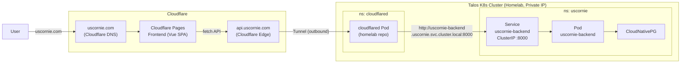

# Deployment Architecture

This document describes the system architecture for deploying the Frontend on Cloudflare Pages and connecting to the Backend in a Homelab via Cloudflare Tunnel.

## Architecture Diagram

## Workflow

1.  **Frontend Access**: User accesses `uscornie.com` -> Cloudflare Pages serves the static SPA (Vue).
2.  **API Call**: Frontend calls the API at `https://api.uscornie.com/`.
3.  **Tunnel Routing**: `api.uscornie.com` is routed through **Cloudflare Tunnel** (no public ports or IPs required).
4.  **Homelab Processing**: `cloudflared` Pod receives the request -> forwards it to the **K8s Service** `uscornie-backend` (ClusterIP).
5.  **Backend Execution**: The Service load-balances to backend Pods. Backend accesses the **CloudNativePG** database.

## Responsibility Matrix

- **Repository `uscornie`**: Contains frontend/backend source code, CI/CD configuration, and K8s manifests for the application.
- **Repository `homelab`**: Contains infrastructure configuration such as Cloudflare Tunnel (`cloudflared`) and helmfile for managing releases.
