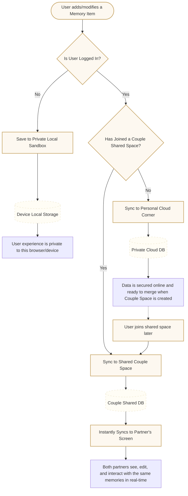

# Save Items Synchronization Architecture

This document describes the technical architecture, business logic, and functional data flow for the **Save Items** feature in Uscornie.

---

## 1. Feature & Business Overview

The Save Items feature is designed to be the digital repository of shared couples' memories, aspirations, and plans (wishlists, bucket lists, cafe logs, and movie trackers).
To maximize user retention and seamless user experience, the sync architecture operates on two levels:

1. **Seamless Guest Onboarding (Offline Sandbox):** Users can instantly save memories without signing up. The data remains securely cached locally on their device.
2. **Couple Real-time Synchronization (Shared Space):** Once authenticated, the app shifts from a personal sandbox into a shared couple experience. Memories are synced to a central database and instantly shared between the two partners' devices.

---

## 2. Business Flow & Functional Diagram

The diagram below represents how the system determines where to route and store user data based on their authentication status and couple affiliation.

---

## 3. Database Schema

The `Item` entity is mapped as a SQLAlchemy model in the database:

| Column Name | Type | Constraints | Description |
| :--- | :--- | :--- | :--- |
| **id** | VARCHAR | Primary Key, UUID | Unique identifier for each item |
| **space_id** | VARCHAR | Foreign Key (`spaces.id`) | Scopes the item to its designated space |
| **category** | VARCHAR | Not Null | Category ID (e.g., `wishlist`, `movies`, `food`) |
| **title** | VARCHAR | Not Null | Title of the item |
| **desc** | VARCHAR | Nullable | Optional detailed description |
| **tag** | VARCHAR | Nullable | Optional tag identifier |
| **created_at**| TIMESTAMP| Default UTC now | Creation timestamp |

---

## 4. API Specification

All endpoints are authenticated and enforce space membership validation checks.

### 1. Get Items

* **Route:** `GET /spaces/{space_id}/items`
* **Response:** `200 OK` (List of items ordered by `created_at DESC`)
* **Security:** Fails with `403 Forbidden` if the authenticated user is not a member of the space.

### 2. Create Item

* **Route:** `POST /spaces/{space_id}/items`
* **Request Body:** `ItemCreate` (JSON)
* **Response:** `201 Created` (The inserted item payload)
* **Security:** Fails with `403 Forbidden` if the authenticated user is not a member of the space.

### 3. Update Item

* **Route:** `PUT /spaces/{space_id}/items/{item_id}`
* **Request Body:** `ItemUpdate` (JSON)
* **Response:** `200 OK` (The updated item payload)
* **Security:** Fails with `403 Forbidden` if the user is not in the space, or `404 Not Found` if the item does not belong to the space.

### 4. Delete Item

* **Route:** `DELETE /spaces/{space_id}/items/{item_id}`
* **Response:** `204 No Content`
* **Security:** Fails with `403 Forbidden` if the user is not in the space, or `404 Not Found` if the item does not belong to the space.

---

## 5. State Division & Architectural Guidelines

* **Decoupled Stores:** Server state must remain strictly in TanStack Query caches. **Never copy server data into the Zustand store** to avoid data discrepancy, infinite rendering loops, and syncing bugs.
* **Declarative Resets:** Rely on React `key` props (e.g. `key={activeSpaceId}`) to clean and remount feature components when dependencies change, instead of adjusting state in `useEffect` hooks.
