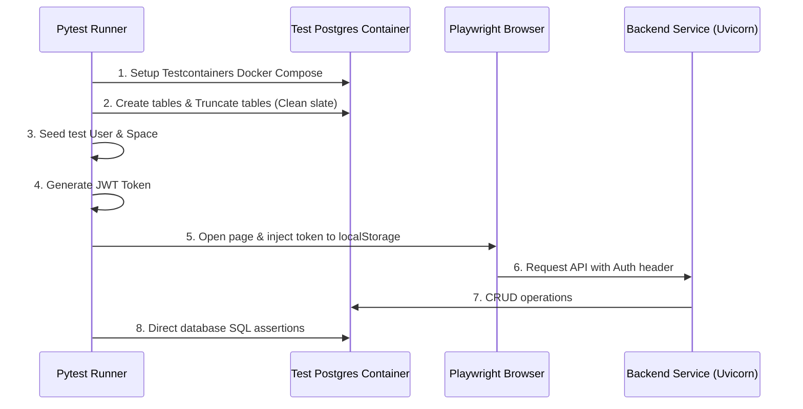

# Uscornie E2E & Integration Testing Suite

This directory contains integration and end-to-end (E2E) testing scenarios for the Uscornie application using **Python + Playwright** for browser automation, and **Testcontainers** for programmatic Docker Compose orchestration.

## 📐 Architecture & Test Lifecycle Flow



## 🛠️ Setup & Execution Guide

### 1. Prerequisites

Ensure that the Docker daemon (Docker Desktop or Colima) is running and your root-level `.env` file exists (based on `.env.example`).

### 2. Configure Virtual Environment

```bash
cd test
uv venv
source .venv/bin/activate
uv pip install -e .
uv run playwright install --with-deps chromium
```

### 3. Run Tests

* **Run all tests in headless mode:**

  ```bash
  uv run pytest
  ```

* **Run in headed mode (shows the browser UI - useful for debugging):**

  ```bash
  uv run pytest --headed --slowmo 1000
  ```

* **Run tests in parallel (using pytest-xdist):**

  ```bash
  uv run pytest -n 3
  ```

  *Note: The master process coordinates starting the Docker Compose environment exactly once, while worker processes run the tests in isolation using dynamic unique user scopes to prevent database record collisions.*
